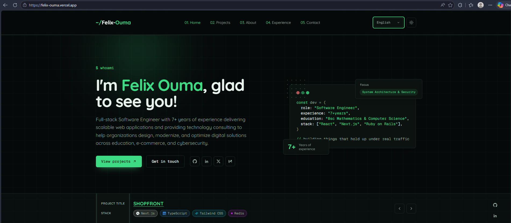

# Felix Ouma  Portfolio

A full-stack personal portfolio built with Next.js 16 (App Router), TypeScript,
Tailwind CSS v4, Prisma, and Auth.js. Includes a public site (home, project
listing, project detail pages) and a protected administrator dashboard for managing
projects and reading contact form submissions.

## Tech stack

- **Framework:** Next.js 16 (App Router, Turbopack, React 19.2)
- **Styling:** Tailwind CSS v4, dark-mode-default "terminal" theme with a
  light mode toggle
- **Database:** Prisma 7 + SQLite locally (via the `better-sqlite3` driver
  adapter), swappable for Postgres in production
- **Auth:** Auth.js (NextAuth) v5, single credentials-based admin user
- **Validation:** Zod, shared between client forms and API routes
- **Forms:** React Hook Form
- **Animation:** Motion (the successor to Framer Motion)
- **Testing:** Vitest, run directly against the Route Handler functions
